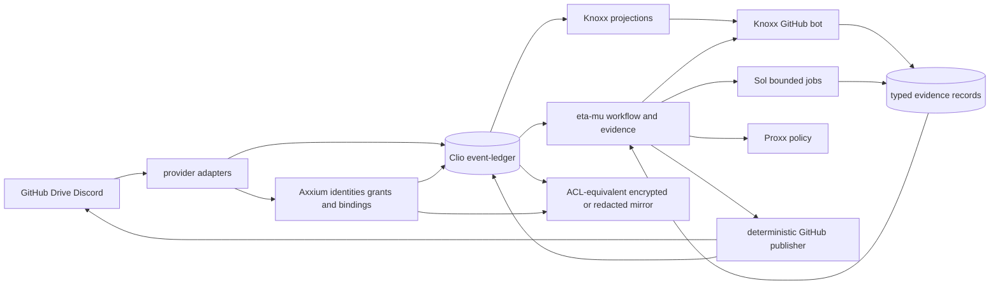
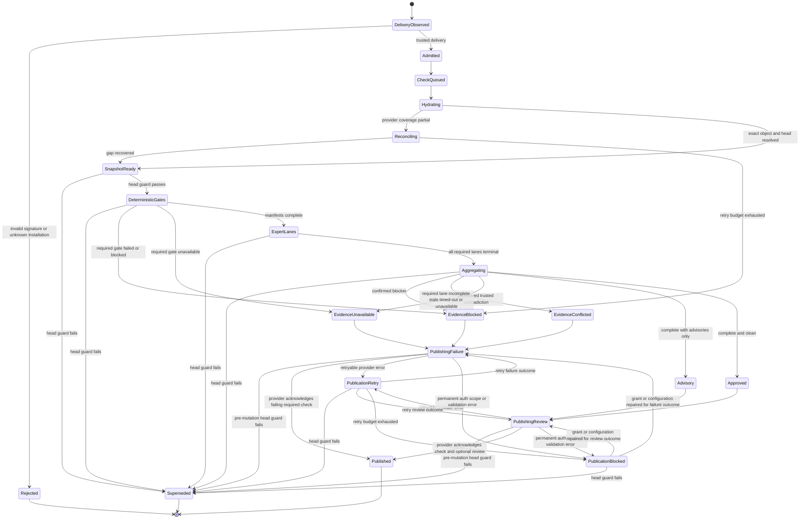

# Axxium Event Fabric

**Status:** proposed execution architecture
**Date:** 2026-09-01
**Tracking:** Foresight issue #71
**Scope:** GitHub, Google Drive, Discord, test and review evidence, Proxx policy, Knoxx projections, Axxium identity, Katamorph resources, Clio/event-ledger records, Sol execution, and an Electron operator client.

## Decision

Build one identity-bound event fabric rather than separate provider, review, graph,
and policy databases.

The authorities remain distinct:

1. **Provider adapters** verify signatures, hydrate provider objects, reconcile
   missed changes, and perform provider commands.
2. **Axxium** assigns durable identities and versioned bindings to principals,
   provider accounts, installations, authorization grants, external objects,
   streams, protection domains, and execution episodes.
3. **Clio-compatible records plus event-ledger** own admission, ordering,
   idempotency profiles, replay, checkpoints, retention, immutable segments, and
   compaction receipts.
4. **Katamorph** declares portable actor, role, capability, source, store,
   action, workflow, and policy resources.
5. **Eta-mu** classifies GitHub events, coordinates workflows, validates and
   aggregates evidence, and owns deterministic provider-publication policy.
6. **Knoxx** builds rebuildable document, tag, search, graph, and evidence
   projections and hosts the context-rich GitHub bot.
7. **Sol** executes explicitly authorized exact-input jobs under bounded
   capabilities and resource budgets.
8. **Proxx** evaluates versioned OpenAI-compatible routing policy. Its external
   service retains provider credentials, quotas, live account state, streaming,
   and request execution.
9. **Foresight** pins the composed revisions and proves cross-repository
   conformance without taking semantic authority from child repositories.

A webhook is a signal, not provider-object truth. A graph node is a projection,
not event authority. A model response is a candidate evidence record, not a
GitHub verdict. A Drive mirror is another protected storage location, not
permission to widen disclosure.

## Authority table

| Concern | Authority | Must not become authority |
| --- | --- | --- |
| Portable resource grammar and references | Katamorph | Provider SDK objects |
| Principal, account, installation, grant, object, stream, and episode bindings | Axxium | Usernames, filenames, content hashes, JWT claims |
| Record admission, order, replay, checkpoint, and retention | event-ledger | Webhook queues, Drive folders, Knoxx indexes |
| Content-addressed schema and canonical record dialect | Clio | Raw provider payloads |
| Signatures, hydration, reconciliation, and provider commands | Provider adapters | Model prompts or portable schemas |
| Workflow coordination, evidence fold, and publication policy | Eta-mu | An individual reviewer model |
| Search, document, tag, graph, and evidence projections | Knoxx | Source ledgers |
| Bounded exact-input execution | Sol | Ambient shell or provider authority |
| OpenAI-compatible route selection | Proxx policy kernel | TypeScript route handlers |
| Provider secrets, quotas, live state, and streaming | Proxx service adapters | Portable EDN resources |
| Cross-repository composition and exact-revision proof | Foresight | Child domain implementations |

## System view



## Identity and record law

The system must not collapse:

- a human or service principal;
- a provider account;
- a GitHub App, Discord bot, or Google authorization installation;
- an authorization grant and its validity interval;
- a provider repository, pull request, Drive file, guild, channel, or message;
- an append-only observation stream;
- one admitted physical record;
- one normalized semantic occurrence;
- a review snapshot;
- a runtime, test, or reviewer episode;
- an evidence artifact, finding, verdict, check, review, or publication receipt;
- a content-equivalence identity shared by byte-equivalent documents.

Immutable provider IDs participate in identity and scope. Mutable names, paths,
numbers, and URLs remain locators. Repository rename or transfer must not mint a
second Axxium object or stream.

```clojure
{:binding/id "axxium:binding:github-pr-object"
 :binding/kind :provider-object
 :provider :github
 :provider/scope {:installation/id "987"
                  :repository/id "654321"}
 :provider/locator {:repository/name "open-hax/foresight"
                    :pull-request/number 69}
 :provider/object-kind :pull-request
 :provider/object-id "PR_kwDO..."
 :object/id "axxium:object:..."}
```

Every new admitted record distinguishes:

- `:record/id`: one physical admitted record;
- `:stream/id` and `:stream/position`: its Axxium-bound ordered history;
- `:event/id`: a normalized source occurrence under a declared idempotency law;
- `:source/delivery-id`: webhook or Gateway delivery identity;
- `:source/object-id`: immutable provider object identity;
- `:source/revision`: hydrated provider revision;
- `:payload/hash`: normalized payload identity.

No fold may discard records merely because a historical `:event/id` collides.
Semantic idempotency and physical-record identity are separate laws.

```clojure
{:record/id "urn:uuid:..."
 :record/version 1
 :stream/id "axxium:stream:..."
 :stream/position 42

 :event/id "github:delivery:...:pull_request:synchronize"
 :event/kind :github/pull-request-observed
 :event/role :observation
 :event/occurred-at "2026-09-01T15:01:00Z"
 :event/observed-at "2026-09-01T15:01:02Z"

 :source/provider :github
 :source/delivery-id "..."
 :source/object-id "PR_kwDO..."
 :source/revision "full-head-sha"
 :source/locator {:installation/id "987"
                  :repository/id "654321"
                  :repository/name "open-hax/foresight"
                  :pull-request/number 69}

 :identity/principal-binding "axxium:binding:..."
 :identity/object-binding "axxium:binding:..."
 :identity/installation-binding "axxium:binding:..."
 :identity/grant-binding "axxium:grant:..."

 :causal/root "urn:uuid:..."
 :causal/parent "urn:uuid:..."
 :contracts [{:resource/id :open-hax.github/interaction
              :resource/revision "content-hash-or-commit"}]

 :payload/hash "sha256:..."
 :payload {...}
 :privacy/classification :workspace
 :privacy/source-policy "policy:sha256:..."
 :retention/policy :source-history}
```

An event profile may omit inapplicable fields. It may not invent a principal,
installation, grant, causal parent, exact revision, coverage state, or successful
outcome.

## File-backed ledger families

Use newline-delimited EDN: one complete map per nonblank line. Repository-local
authority remains under `.ημ/`; `.eta-mu` is a compatibility locator, not a
second ledger authority.

```text
.ημ/
  ledgers/
    github/<stream>/segments/<first>-<last>-<sha256>.edn
    google-drive/<stream>/segments/<first>-<last>-<sha256>.edn
    discord/<stream>/segments/<first>-<last>-<sha256>.edn
    tests/<stream>/segments/<first>-<last>-<sha256>.edn
    evidence/<stream>/segments/<first>-<last>-<sha256>.edn
    tags/<stream>/segments/<first>-<last>-<sha256>.edn
  manifests/<stream-id>.edn
  checkpoints/<provider>/<installation-or-authorization-id>.edn
  projections/document-index.edn
  projections/graph-index.edn
  projections/evidence-index.edn
```

A sealed segment is immutable. A manifest references segment hashes and stream
positions. Appending or sealing advances a manifest through expected-position
comparison. Compaction appends a receipt and never silently rewrites history.

## Google Drive mirror and confidentiality

Drive is an off-device discovery and mirror surface only when source
confidentiality can be preserved. It is not an atomic multi-writer append
system, and it is not one globally shared folder of raw payloads.

Before copying bytes, the adapter derives an Axxium-bound protection domain from
the source object, source grant, privacy policy, and effective principals. A
segment may be mirrored only under a proven mode:

1. **ACL-equivalent partition:** the Drive object and every ancestor grant access
   to no principal broader than the effective source grant;
2. **Envelope-encrypted segment:** Drive stores ciphertext, and the data key is
   available only to Axxium-bound principals with a current source grant;
3. **Redacted or metadata-only mirror:** restricted fields are omitted while
   hashes, source identity, positions, and coverage remain discoverable.

Otherwise the adapter appends `:ledger/mirror-blocked` with reason
`:confidentiality-not-preserved` and copies no raw payload.

For every discovered `.ημ/` or `.eta-mu/` source, the adapter must:

1. bind source, object, stream, grant, and protection domain through Axxium;
2. evaluate privacy and retention policy before reading payload bytes;
3. verify immutable segment hashes;
4. prove ACL-equivalent, encrypted, or redacted mirror mode;
5. copy only the permitted representation;
6. append mirror-observed, mirrored, blocked, or diverged records;
7. project source locators, Drive object IDs, and protection domains;
8. never infer identity or authority from filename alone.

Source revocation removes Drive grants or rotates/revokes envelope keys, stops
restricted projections, and appends a revocation receipt. If effective
withdrawal cannot be proved, the mirror is quarantined and coverage becomes
blocked. Copies exported beyond controlled storage remain an explicit
non-recoverable limitation.

Drive push notifications wake the reconciler. The reconciler consumes the
changes feed from a persisted page token and hydrates changed objects. A
notification header is signal evidence, not the changed object.

## Document tags and projections

“Tag every document” means append tag assertions and retractions. It does not
mean rename provider-owned files or inject mutable frontmatter.

```clojure
{:event/kind :tag/asserted
 :event/role :attestation
 :subject/object-binding "axxium:binding:..."
 :tag/id :artifact/architecture
 :tag/value true
 :tag/source :classifier/rule
 :tag/confidence 1.0
 :tag/rule {:id :rule/path-and-content-v1
            :revision "sha256:..."}}
```

The current tag set is a projection. Tag, search, and graph queries enforce the
same Axxium grant and privacy policy as their source records. A projection may
not disclose restricted existence, titles, snippets, or relations merely because
bytes were mirrored.

Indexes are keyed by Axxium object identity and immutable provider ID, not title
or path. Byte-equivalent documents may share a content-equivalence node while
retaining separate provider identities, permissions, locations, revisions, and
histories.

## Portable interaction layer

Do not begin with one universal provider API. Stabilize the smallest operations
implemented by at least two adapters:

```clojure
(defprotocol InteractionAdapter
  (describe-capabilities [adapter])
  (discover! [adapter request])
  (hydrate! [adapter object-ref])
  (watch! [adapter subscription])
  (reconcile! [adapter checkpoint])
  (checkpoint [adapter])
  (apply-command! [adapter command]))
```

Calls receive and return Clojure-shaped maps. Provider SDK values are decoded in
extern adapters. Every result records `:complete`, `:partial`, `:blocked`, or
`:unavailable` coverage.

Katamorph composes existing resource kinds: actor, role, capability, source,
action, store, workflow, and policy. Its model-provider contract must not be
overloaded to mean GitHub, Drive, or Discord.

## GitHub vertical slice

Use a GitHub App rather than repository-by-repository personal OAuth hooks.
Human login and installation authority are separate Axxium bindings.

```text
signed delivery
  -> signature and delivery verification
  -> queued check at the exact head
  -> raw delivery record
  -> fast acknowledgement
  -> eta-mu classification
  -> provider hydration and reconciliation
  -> Axxium principal, installation, grant, object, stream bindings
  -> normalized observation record
  -> Knoxx graph, document, search, and evidence projections
  -> deterministic input and dependency-closure manifests
  -> bounded Knoxx and Sol evidence jobs
  -> deterministic evidence fold
  -> check/review publication attempt and receipt
```

Required laws:

- verify the signature before trusted admission;
- retain `X-GitHub-Delivery`, event/action identity, installation ID, immutable
  repository ID, pull-request object ID, and exact head;
- create or update an exact-head queued check before slow work, so loss of later
  publication cannot create a false green;
- deduplicate delivery retries without erasing separate physical records;
- reconcile missed deliveries, permission gaps, and rate limits;
- discover `.ημ` and `.eta-mu` without treating path as identity;
- publish through an installation token kept outside model context;
- record incomplete provider coverage as partial, blocked, or unavailable rather
  than empty success.

## Total review workflow

A head-change guard runs before every post-snapshot transition and immediately
before every provider mutation. The guard compares immutable repository ID,
pull-request object ID, and current head SHA with the episode snapshot. A
mismatch appends `:review/episode-superseded`, cancels outstanding jobs, and
starts a new episode. Results and publications already attached to the old SHA
remain valid only for that old SHA.



`PublicationRetry` and `PublicationBlocked` are open reconciliation obligations,
not published terminal states. Each failed attempt appends a receipt containing
the provider request identity, exact head, outcome intended for publication,
HTTP/error class, response digest, retry count, next reconciliation time, and
current grant identity. A permanent 403, invalid installation, exhausted rate
limit, or unrecoverable transport error therefore cannot be misreported as
`Published`.

The early queued required check remains non-success while publication is blocked.
If even queued-check creation fails, the required check is absent and branch
protection remains fail-closed; the failure receipt and reconciliation obligation
remain visible through the ledger, Knoxx, and an operator alert channel.

### Required-check conclusions

A check resource declares `:check/required?` at a pinned revision.

- A required check may publish `success`, `failure`, `cancelled`,
  `timed_out`, or `action_required` according to the provider contract.
- Failed, blocked, unavailable, conflicted, stale, or incomplete evidence may
  never publish `success` or `neutral` for a required check.
- `neutral` is permitted only for a separately named check whose resource proves
  `:check/required? false`; it cannot satisfy the required evidence check.
- A superseded old-head episode publishes `cancelled` when a queued check exists.
  The new head receives a distinct episode and check.

## Test and gate evidence

Lift Foresight's revision-bound runner into a reusable event-producing runner.
Every invocation appends `:test/run-started` before process spawn and exactly one
terminal result on success, failure, setup error, timeout, cancellation, signal,
or result-validation failure.

A terminal result contains an executable dependency closure, not a prose list:

```clojure
{:event/kind :test/run-finished
 :event/role :attestation
 :test/run-id "axxium:episode:..."
 :test/target :open-hax/proxx
 :test/gate-kind :integration
 :test/command ["pnpm" "test"]

 :test/revision {:repository/id "123456"
                 :repository/name "open-hax/proxx"
                 :commit "full-commit-sha"
                 :tree "full-tree-sha"
                 :dirty? false
                 :inputs/hash "sha256:..."}

 :test/dependency-closure
 {:closure/id "closure:sha256:..."
  :closure/hash "sha256:..."
  :closure/algorithm :git-tree-and-runtime-inputs-v1
  :closure/entries
  [{:kind :repository
    :repository/id "123456"
    :revision "full-commit-sha"
    :tree "full-tree-sha"}
   {:kind :workflow
    :identity "open-hax/eta-mu/.github/workflows/opencode-code-review.yml"
    :revision "full-provider-commit-sha"}
   {:kind :toolchain :identity "node" :revision "22.23.2"}
   {:kind :lockfile :path "pnpm-lock.yaml" :hash "sha256:..."}]}

 :test/environment {:runner/id "axxium:principal:..."
                    :runtime {:node "22.23.2" :nbb "1.4.208"}
                    :platform "linux-x64"}
 :test/outcome :passed
 :test/counts {:tests 52 :assertions 216 :failures 0 :errors 0}
 :test/artifacts [{:kind :junit :hash "sha256:..." :locator {...}}]
 :test/stdout {:hash "sha256:..." :locator {...}}
 :test/stderr {:hash "sha256:..." :locator {...}}}
```

The closure is generated from executable build and workflow configuration,
validated before use, retained by digest, and replayable. Any changed entry
changes its hash. Prior evidence is reusable only when trusted producer,
contracts, target inputs, dependency closure, and required environment facts
match exactly.

`passed`, `cached`, `failed`, `blocked`, `unavailable`, and approved
`not-applicable` remain distinct. A failed result never suppresses a rerun.

## Parallel expert evidence lanes

Eta-mu issue #324 owns a fan-out of narrow expert lanes:

- diff and ownership;
- contract and executable schema;
- tests and failure traces;
- coverage and mutation evidence;
- executable dependency closure;
- CI and producer provenance;
- security and secret boundaries;
- replay and idempotency;
- Knoxx graph and projection consistency;
- documentation, diagrams, and operator experience.

Each lane has a pinned resource revision, immutable snapshot, bounded tools and
budgets, Axxium actor and episode identity, explicit inspected-artifact manifest,
coverage status, and typed findings. Lanes never publish directly.

```clojure
{:evidence/lane :contracts
 :evidence/lane-revision "resource-hash"
 :review/repository-id "654321"
 :review/pull-request-object-id "PR_kwDO..."
 :review/head "full-sha"
 :review/snapshot-hash "sha256:..."
 :review/episode "axxium:episode:..."
 :coverage/status :complete
 :coverage/inspected [{:kind :diff :hash "sha256:..."}]
 :findings
 [{:finding/id "content-addressed-id"
   :finding/status :confirmed
   :finding/severity :high
   :finding/path "src/example.cljs"
   :finding/line 73
   :finding/failure-trace "..."
   :finding/evidence [{:kind :validator-output
                       :artifact/hash "sha256:..."}]}]}
```

Deterministic aggregation must:

- verify producer, head, snapshot, lane revision, dependency closure, and artifact
  identity;
- reject mutated or unsupported evidence;
- reject a blocking claim without a concrete failure trace and retained artifact;
- deduplicate by semantic claim, location, and evidence identity;
- preserve disagreements without vote counting;
- send unresolved trusted contradictions to `EvidenceConflicted`;
- send any required partial, timed-out, unavailable, stale, or missing lane to
  `EvidenceUnavailable`;
- allow `Advisory` or `Approved` only when all required lanes are complete;
- publish success only when required deterministic gates and required lanes are
  complete and no confirmed blocker or unresolved contradiction exists.

Parallelism narrows expertise and reduces time-to-evidence. Repeated same-model
agreement is not proof.

## Knoxx GitHub bot

Knoxx issue #295 owns the bot surface. It consumes admitted GitHub and evidence
records and projects provider objects, Axxium grants, streams, causal links, test
runs, artifacts, findings, contradictions, verdicts, checks, reviews, publication
attempts, and receipts.

The bot can answer:

- what triggered this episode and which exact head it covers;
- which contracts, files, tests, prior findings, and dependency revisions matter;
- what evidence exists, is stale, conflicts, or remains unavailable;
- which workflow node is running, blocked, or awaiting publication repair;
- which agent owns the next bounded action;
- which retained artifact supports a blocking or advisory finding.

It emits typed plans and evidence. Deterministic eta-mu code owns publication.
Every context manifest is grant-filtered, stably ordered, size-bounded, and
replayable.

## Sol execution boundary

Sol issue `octave-commons/eta-mu-sol#2` owns bounded execution. A job requires:

- Axxium actor, episode, target, and grant identities;
- immutable repository ID, commit, tree, and review snapshot;
- an executable dependency closure;
- digest-verified inputs;
- declared capability, wall-time, process, output, filesystem, and network
  budgets;
- a started record and exactly one terminal record.

Sol receives no GitHub App private key or publication token. Eta-mu validates and
admits its result before publication.

## Proxx as kernel and service

Separate Proxx's pure policy kernel from its live service:

```text
proxx.policy.kernel       pure CLJS/CLJC validation compilation and decisions
proxx.policy.resources    versioned Katamorph-compatible EDN programs
eta-mu.proxx.plugin       in-process adapter with no provider secrets
proxx.runtime.nbb         NBB HTTP CLI and worker host for Node-adjacent effects
proxx.service             credentials OAuth quotas streaming and execution
```

Eta-mu may evaluate policy without a network call, but loading the plugin grants
no secrets. Proxx receives Axxium actor and capability bindings and returns a
decision citing policy revisions. Knoxx and Proxx use the same Axxium identities
without sharing application-local sessions.

New routing semantics remain EDN and CLJS. NBB is the preferred backend host
where its SCI and Node surfaces suffice; shadow-cljs remains valid for browser
artifacts and backend slices not yet lawful under NBB. Runtime migration may not
fork policy semantics.

The older AT Protocol and DID federation design remains useful lineage:
owner-scoped append-only diffs, resumable cursors, DID references, and lazy
projections. Axxium absorbs durable identity and binding law rather than Proxx
inventing a second principal system.

## OAuth and Electron boundary

The Electron client is an Axxium operator surface, not another identity
provider.

- login choices: GitHub, Google, Discord;
- system-browser Authorization Code flow with PKCE;
- explicit identity-link events bind provider subjects to Axxium principals;
- human login, app installation, Drive consent, and Discord guild installation
  remain separate grants;
- long-lived tokens and provider secrets stay in the main process or operating
  system credential store;
- renderer Node integration is disabled for remote content;
- context isolation and sandboxing are enabled;
- IPC is narrow, validated, and capability-scoped;
- OAuth success never implies access to every repository, Drive object, guild,
  channel, or message.

## Projection graph

Knoxx projects at least:

```text
AxxiumPrincipal ProviderAccount ProviderInstallation AuthorizationGrant
ProtectionDomain Repository Commit Issue PullRequest Review ReviewThread
CheckRun WorkflowRun Drive DriveFile DriveRevision DiscordGuild DiscordChannel
DiscordThread DiscordMessage DiscordAttachment LedgerStream LedgerSegment
TestRun EvidenceArtifact Finding Contradiction Verdict PublicationAttempt
PublicationReceipt PolicyResource Tag ContentIdentity AgentRun SolJob
```

Important edges include:

```text
BOUND_TO AUTHORIZED_BY PROTECTED_BY INSTALLED_IN OBSERVED_AS REVISION_OF
PARENT_OF REFERENCES MENTIONS ATTACHED_TO MIRRORED_AS CONTAINS_LEDGER
CAUSED_BY TESTED PROVED EVALUATED_BY TAGGED_WITH CONTENT_EQUIVALENT_TO
DISPATCHED_TO SUPPORTED_BY CONTRADICTS PUBLISHED_AS SUPERSEDED_BY
```

Every node and edge carries the admitted record IDs and stream positions that
produced it. Projection queries enforce Axxium grants. Rebuilding from the same
admitted history must reproduce the same identities and relations.

## Execution sequence

1. **Review-clean contracts:** land Katamorph #27, Knoxx #294, and this design.
2. **Signed GitHub admission:** re-scope eta-mu #206; verify one signed fixture;
   bind identities and grants; admit delivery, object, coverage, and queued-check
   records; prove redelivery safety.
3. **Knoxx bot path:** project the object and `.ημ` discovery; build a
   deterministic grant-filtered context manifest; trigger the GitHub actor;
   project returned evidence; prove replay equivalence.
4. **Strong evidence checks:** implement closed result schemas, deterministic
   aggregation, the contract/test/CI lanes, progressive exact-head checks,
   stale-head supersession, contradiction handling, and publication repair.
5. **Sol execution:** isolate exact-input jobs, enforce budgets, and admit every
   terminal outcome before publication.
6. **Provider breadth:** add protected Drive mirrors, Discord REST plus Gateway
   history, Proxx kernel/NBB migration, and the Electron operator surface.

## Tracked work

- Foresight issue #71 and PR #69;
- Katamorph PR #27;
- eta-mu issues #159, #206, #233, #240, #248, #270, #323, and #324;
- Knoxx PR #294 and issue #295;
- Sol issue `octave-commons/eta-mu-sol#2`;
- Axxium Knoxx/Proxx identity migrations and Discord OAuth card;
- Knoxx Drive ingestion, source-lake, graph-query, and evidence-projection work;
- Proxx AT-DID lineage and CLJS/EDN policy boundary;
- Foresight revision-bound evidence gates and exact-head runner.

## First completion gate

The first slice is complete only when one signed GitHub fixture can be delivered
twice without duplicate semantic effects, hydrated into an Axxium-bound object,
written to an ND-EDN ledger, replayed into the same grant-filtered Knoxx graph
and context manifest, dispatched to one bounded evidence job, accompanied by a
revision-and-closure-bound test result, and published as an exact-head required
check whose receipt survives replay.

A failed, unavailable, conflicted, or incomplete gate must leave the required
check non-success. A provider-publication failure must leave a failed-attempt
receipt and an open reconciliation obligation; it may not masquerade as
`Published`.

## Non-goals

- one universal payload vocabulary for every domain;
- treating webhook delivery as provider truth;
- treating Drive as a mutable multi-writer append database or permission-widening
  archive;
- copying restricted payloads without proven ACL equivalence, encryption, or
  redaction;
- rewriting historical ledgers to fit a new envelope;
- deriving identity from email, username, repository name, path, filename, title,
  or content hash alone;
- claiming coverage outside recorded provider scopes and retained history;
- moving provider secrets into Katamorph, Axxium records, eta-mu plugins, Knoxx
  projections, prompts, or Drive;
- allowing a model or evidence lane to publish directly or adjudicate its own
  sufficiency;
- publishing neutral for a required evidence check;
- treating a provider mutation attempt as successful publication;
- same-model vote counting as confidence;
- replacing Proxx, Knoxx, or every test runner in one pull request.
