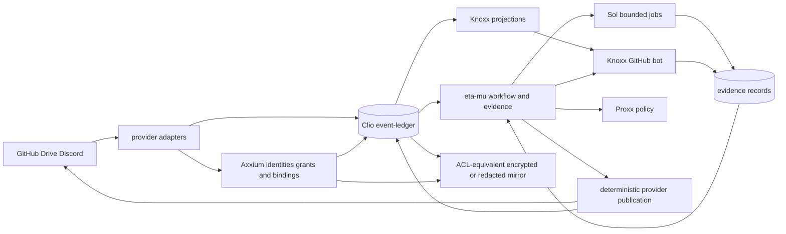
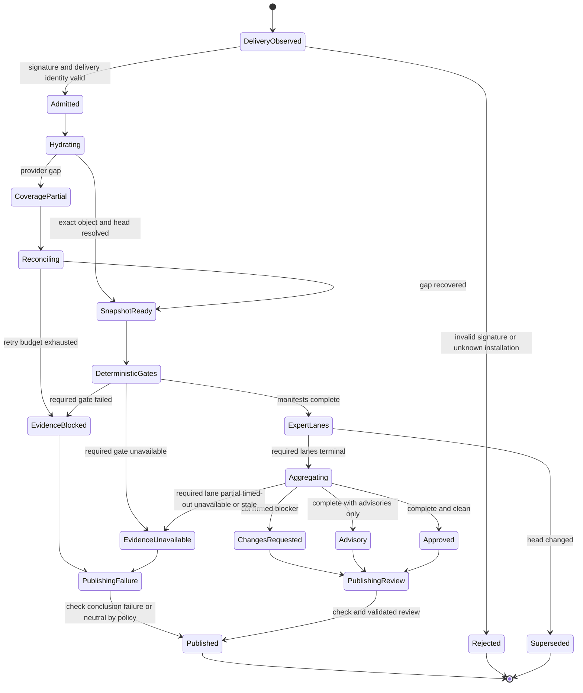

# Axxium Event Fabric

**Status:** proposed execution architecture
**Date:** 2026-09-01
**Tracking:** Foresight issue #71
**Scope:** GitHub, Google Drive, Discord, test and review evidence, Proxx policy, Knoxx projections, Axxium identity, Katamorph resources, Clio/event-ledger records, Sol execution, and an Electron operator client.

## Decision

Build one identity-bound event fabric rather than separate GitHub, Drive, Discord, test, Knoxx, and Proxx databases.

The authorities are distinct:

1. **Provider interaction adapters** verify, observe, hydrate, reconcile, and act through provider-specific APIs.
2. **Axxium** assigns durable identities and bindings to principals, provider accounts, installations, external objects, streams, grants, and execution episodes.
3. **Clio-compatible records plus event-ledger** admit, order, replay, checkpoint, retain, and compact append-only histories.
4. **Katamorph** declares portable actor, source, store, action, workflow, capability, and policy resources.
5. **Eta-mu** classifies provider events, interprets workflow/runtime contracts, validates and aggregates evidence, and publishes deterministic GitHub outcomes.
6. **Knoxx** builds disposable document, tag, search, graph, and evidence projections and hosts the context-rich GitHub bot.
7. **Sol** executes explicitly authorized, exact-input jobs under bounded capabilities.
8. **Proxx** evaluates versioned OpenAI-compatible routing policy while its external service retains provider credentials and live execution state.
9. **Foresight** pins composed revisions and proves cross-repository conformance without taking semantic authority from child repositories.

A webhook delivery is a signal, not provider-object truth. A graph node is a projection, not event authority. A model response is a candidate record, not a GitHub verdict. A mirror is another protected storage location, not permission to widen disclosure.

## Authority table

| Concern | Authority | Must not become authority |
| --- | --- | --- |
| Portable resource grammar and references | Katamorph | Provider SDK objects |
| Principal, account, installation, object, stream, grant, and episode bindings | Axxium | Usernames, filenames, content hashes, JWT claims |
| Record admission, ordering, replay, checkpoint, and retention | event-ledger | Webhook queues, Drive folders, Knoxx indexes |
| Content-addressed schema and event canonicalization | Clio | Raw provider payloads |
| Provider signatures, hydration, reconciliation, and commands | Provider adapters | Katamorph schemas or model prompts |
| Workflow coordination and evidence verdict/publication | eta-mu | An individual review model |
| Search, document, tag, graph, and evidence projections | Knoxx | Source ledgers |
| Bounded exact-input execution | Sol | Ambient shell or provider authority |
| OpenAI-compatible route selection | Proxx policy kernel | TypeScript route handlers |
| Provider credentials, quotas, live account state, and streaming | Proxx service adapters | Portable EDN resources |
| Cross-repository revision composition and proof | Foresight | Child domain implementations |

## System view



## Identity law

The system must not collapse:

- a human or service principal;
- a provider account;
- a GitHub App, Discord bot, or Google authorization installation;
- a provider repository, pull request, Drive file, guild, channel, or message;
- an authorization grant and its validity interval;
- an append-only stream containing observations about an object;
- one admitted physical record;
- one normalized semantic event occurrence;
- a content-equivalence identity shared by byte-equivalent documents;
- a review snapshot;
- a runtime or test episode;
- an evidence artifact, finding, verdict, or publication receipt.

Axxium bindings are additive, versioned facts. Provider identities remain visible.

```clojure
{:binding/id "axxium:binding:principal-github-123456"
 :binding/kind :principal/provider-account
 :principal/id "axxium:principal:..."
 :provider :github
 :provider/subject-id "123456"
 :valid/from "2026-09-01T00:00:00Z"
 :valid/to nil}

{:binding/id "axxium:binding:github-pr-object"
 :binding/kind :provider-object
 :provider :github
 :provider/scope {:installation/id "987"
                  :repository/id "654321"}
 :provider/locator {:repository/name "open-hax/foresight"
                    :pull-request/number 69}
 :provider/object-kind :pull-request
 :provider/object-id "PR_kwDO..."
 :object/id "axxium:object:..."}

{:binding/id "axxium:binding:github-pr-stream"
 :binding/kind :event-stream
 :object/id "axxium:object:..."
 :stream/id "axxium:stream:..."
 :stream/domain :github}
```

Immutable provider IDs participate in identity and scope. Mutable names, paths, numbers, and URLs remain locators. Renaming or transferring a repository must not create a new Axxium object or stream.

### Record identity versus event identity

New records distinguish:

- `:record/id`: one admitted physical record;
- `:stream/id`: the Axxium-bound ordered history;
- `:stream/position`: append position or backend sequence;
- `:event/id`: normalized source occurrence used by a declared idempotency profile;
- `:source/delivery-id`: webhook or Gateway delivery identity;
- `:source/object-id`: immutable provider object identity;
- `:source/revision`: hydrated provider revision;
- `:payload/hash`: normalized payload content identity.

No fold may discard records merely because a historical `:event/id` collides. New admissions require a unique `:record/id`; semantic idempotency is an explicit event-profile law.

### Normalized record profile

```clojure
{:record/id "urn:uuid:..."
 :record/version 1
 :stream/id "axxium:stream:..."
 :stream/position 42

 :event/id "github:delivery:...:pull_request:synchronize"
 :event/kind :github/pull-request-observed
 :event/role :observation
 :event/occurred-at "2026-09-01T15:01:00Z"
 :event/observed-at "2026-09-01T15:01:02Z"

 :source/provider :github
 :source/delivery-id "..."
 :source/object-id "PR_kwDO..."
 :source/revision "full-head-sha"
 :source/locator {:installation/id "987"
                  :repository/id "654321"
                  :repository/name "open-hax/foresight"
                  :pull-request/number 69}

 :identity/principal-binding "axxium:binding:..."
 :identity/object-binding "axxium:binding:..."
 :identity/installation-binding "axxium:binding:..."
 :identity/grant-binding "axxium:grant:..."

 :causal/root "urn:uuid:..."
 :causal/parent "urn:uuid:..."
 :correlation/id "..."

 :contracts [{:resource/id :open-hax.github/interaction
              :resource/revision "git-sha-or-content-hash"}]

 :payload/hash "sha256:..."
 :payload {...}
 :privacy/classification :workspace
 :privacy/source-policy "policy:sha256:..."
 :retention/policy :source-history}
```

A profile may omit inapplicable fields. It may not invent a principal, installation, tenant, causal parent, revision, coverage state, authorization grant, or successful outcome.

## Ledger families and file layout

Use newline-delimited EDN: one complete EDN map per nonblank line. Keep ledgers inspectable and independently mirrorable. Do not build one ever-growing mutable Drive file.

Repository-local authority remains under `.ημ/`; `.eta-mu` is a compatibility locator, not a second ledger authority.

```text
.ημ/
  ledgers/
    github/<installation-or-repository-stream>/segments/<first>-<last>-<sha256>.edn
    google-drive/<drive-or-root-stream>/segments/<first>-<last>-<sha256>.edn
    discord/<guild-or-dm-stream>/segments/<first>-<last>-<sha256>.edn
    tests/<repository-or-target-stream>/segments/<first>-<last>-<sha256>.edn
    evidence/<review-stream>/segments/<first>-<last>-<sha256>.edn
    tags/<workspace-stream>/segments/<first>-<last>-<sha256>.edn
  manifests/<stream-id>.edn
  checkpoints/
    github/<installation-id>.edn
    google-drive/<authorization-id>.edn
    discord/<bot-installation-id>.edn
  projections/
    document-index.edn
    object-index.edn
    tag-index.edn
    graph-index.edn
    evidence-index.edn
```

A sealed segment is immutable. A manifest references segment hashes and positions. Appending or sealing advances the manifest through expected-position comparison. Compaction appends a receipt and never silently rewrites history.

## Google Drive mirror and confidentiality

Drive is a universal off-device discovery and mirror surface only for material whose source confidentiality can be preserved. It is not an atomic multi-writer append database and not one globally shared folder of raw payloads.

Before copying bytes, the mirror adapter derives an Axxium-bound protection domain from the source object, source authorization grant, privacy classification, and effective source principals. A segment may be mirrored only when one of these modes is proven:

1. **ACL-equivalent partition:** the Drive object and every ancestor folder grant access to no principal broader than the effective source grant;
2. **Envelope-encrypted segment:** ciphertext is stored in Drive and the data key is available only through Axxium-bound principals whose source grant is currently valid;
3. **Redacted or metadata-only mirror:** restricted payload fields are omitted while hashes, source identity, positions, and coverage remain useful for discovery.

If none can be proven, the adapter appends `:ledger/mirror-blocked` with reason `:confidentiality-not-preserved` and copies no raw payload.

For every discovered `.ημ/` or `.eta-mu/` source:

1. identify the GitHub repository, Drive object, or Discord message/attachment that exposed it;
2. bind source, object, stream, grant, and protection domain through Axxium;
3. evaluate source privacy and retention policy before reading or copying payload bytes;
4. verify each immutable segment hash;
5. select and prove ACL-equivalent, encrypted, or redacted mirror mode;
6. copy only the permitted representation;
7. append `:ledger/mirror-observed`, `:ledger/segment-mirrored`, `:ledger/mirror-blocked`, or `:ledger/mirror-diverged`;
8. project a catalog mapping source locators to Drive object IDs and protection domains;
9. never infer sameness or authorization from filename alone.

Suggested partitioned layout:

```text
Axxium Event Fabric/
  protection-domains/<domain-id>/
    ledgers/<stream-id>/<segment-hash>.edn-or-age
    manifests/<stream-id>.edn
    indexes/ledger-catalog.edn
    receipts/<yyyy>/<mm>/...
  public-indexes/
    redacted-document-catalog.edn
```

Source access revocation triggers reconciliation. The adapter must remove Drive ACL grants, revoke or rotate envelope keys, stop downstream projection for the revoked principal, and append a revocation receipt. Immutable segment content is not rewritten, but access to its mirrored representation must be withdrawn. If effective revocation cannot be proven, the mirror is quarantined and its coverage becomes blocked. Copies already exported beyond controlled storage are an explicit non-recoverable coverage limitation, never silently treated as revoked.

Drive push notifications wake the reconciler. The reconciler consumes the changes feed from a stored page token and hydrates changed objects. Notification headers are raw signal evidence, not the changed object itself.

## Document tagging and duplicate handling

“Tag every document” means event-source classification assertions. It does not mean rename provider-owned files or inject mutable frontmatter.

```clojure
{:event/kind :tag/asserted
 :event/role :attestation
 :subject/object-binding "axxium:binding:..."
 :tag/id :artifact/architecture
 :tag/value true
 :tag/source :classifier/rule
 :tag/confidence 1.0
 :tag/rule {:id :rule/path-and-content-v1
            :revision "sha256:..."}}
```

Retraction is another record. The current tag set is a projection. Tag, search, and graph queries enforce the same Axxium grant and privacy policy as the source record; a projection may not disclose a restricted title, snippet, relation, or existence merely because its raw segment is mirrored.

The document index is keyed by Axxium object identity and immutable provider ID, not title or path. Byte-equivalent documents may share a content-equivalence node while retaining separate provider object identities, locations, permissions, revisions, and histories.

## Portable interaction layer

Do not begin with one giant universal provider API. Define the smallest operations implemented by at least two adapters:

```clojure
(defprotocol InteractionAdapter
  (describe-capabilities [adapter])
  (discover! [adapter request])
  (hydrate! [adapter object-ref])
  (watch! [adapter subscription])
  (reconcile! [adapter checkpoint])
  (checkpoint [adapter])
  (apply-command! [adapter command]))
```

Calls receive and return Clojure-shaped maps. SDK objects are decoded inside provider extern adapters. Every result states coverage:

```clojure
{:interaction/status :ok
 :interaction/provider :github
 :interaction/capabilities #{:discover :hydrate :watch :reconcile}
 :interaction/objects [...]
 :interaction/signals [...]
 :interaction/next-cursor "..."
 :interaction/coverage {:scope {:installation/id "987"
                                :repository/id "654321"}
                        :complete? false
                        :reason :permission-limited}
 :interaction/evidence [...]}
```

Katamorph composes existing resource kinds:

- `:actor` for declared service and agent actors;
- `:source` for watch, discover, hydrate, and emitted event profiles;
- `:action` for provider commands;
- `:store` for ledger, checkpoint, mirror, and projection capabilities;
- `:workflow` for backfill, reconcile, evidence, renewal, mirror, and revocation jobs;
- `:capability` and `:role` for bounded authority;
- `:policy` for permission, routing, privacy, and retention decisions.

Do not overload Katamorph's model-provider contract to mean GitHub, Drive, or Discord.

## GitHub profile: first vertical slice

Use a GitHub App rather than repository-by-repository personal OAuth hooks. Separate user login from installation authority.

```text
verified webhook
  -> raw delivery signal record
  -> acknowledge quickly
  -> classify event
  -> hydrate repository/object state
  -> bind principal, installation, object, stream, and grant through Axxium
  -> normalized observation record
  -> Knoxx tag/document/graph projections
  -> eta-mu workflow dispatch
  -> bounded Knoxx or Sol agent run
  -> deterministic evidence verdict
  -> GitHub check/review publication
  -> publication receipt
  -> periodic delivery and API reconciliation
```

Required laws:

- validate the webhook signature before trusted admission;
- retain `X-GitHub-Delivery`, event/action identity, installation ID, immutable repository ID, and exact head;
- deduplicate redelivery without erasing distinct physical or normalized records;
- enqueue hydration before slow processing;
- reconcile failed, missed, permission-limited, and rate-limited coverage;
- bind every repository and object to its GitHub App installation and current grant;
- discover `.ημ` and `.eta-mu` paths without treating path or copied filename as identity;
- record incomplete coverage as partial, blocked, or unavailable rather than empty.

## Discord profile

Discord observable history combines:

1. REST discovery/backfill for objects the bot may read;
2. Gateway dispatch events for changes observed after connection.

Outbound Discord webhooks publish notifications; they do not provide complete inbound history. Persist Gateway sequence, session/resume identity, intents, guild/install binding, source permissions, and coverage. Hydrate partial dispatch payloads through REST when allowed and reconcile after disconnects or permission changes.

The truthful scope is every object observable under granted guilds, channel permissions, API endpoints, retained history, and Gateway intents. It is not all Discord. Missing Message Content intent and deletion before first observation remain explicit coverage gaps. Restricted guild/channel payloads may enter only matching protection domains or encrypted mirrors.

## Workflow graph

Every trusted episode reaches a deterministic, published terminal GitHub check. “Blocked” and “unavailable” are non-success conclusions, not silent termination.



A trusted PR episode may terminate without publication only when it is superseded before publication; the superseding episode must publish. Invalid unauthenticated deliveries are rejected before they can create a trusted PR episode.

Katamorph owns the portable graph vocabulary. Eta-mu owns runtime adjudication, retries, cancellation, result admission, and publication. Event-ledger owns accepted/rejected records. Knoxx projects the graph for query and explanation.

## Test and gate evidence

Lift Foresight's revision-bound runner into a reusable event-producing runner. Every invocation writes `:test/run-started` before process spawn and a terminal record on normal exit, spawn error, timeout, cancellation, or signal.

A terminal record contains an executable dependency closure, not a prose dependency list:

```clojure
{:event/kind :test/run-finished
 :event/role :attestation
 :test/run-id "axxium:episode:..."
 :test/target :open-hax/proxx
 :test/gate-kind :integration
 :test/command ["pnpm" "test"]

 :test/revision {:repository/id "123456"
                 :repository/name "open-hax/proxx"
                 :commit "full-commit-sha"
                 :tree "full-tree-sha"
                 :dirty? false
                 :inputs/hash "sha256:..."}

 :test/dependency-closure
 {:closure/id "closure:sha256:..."
  :closure/hash "sha256:..."
  :closure/algorithm :git-tree-and-runtime-inputs-v1
  :closure/entries
  [{:kind :repository
    :repository/id "123456"
    :repository/name "open-hax/proxx"
    :revision "full-commit-sha"
    :tree "full-tree-sha"}
   {:kind :repository
    :repository/id "987654"
    :repository/name "open-hax/katamorph"
    :revision "full-commit-sha"
    :tree "full-tree-sha"}
   {:kind :workflow
    :identity "open-hax/eta-mu/.github/workflows/opencode-code-review.yml"
    :revision "full-provider-commit-sha"}
   {:kind :toolchain
    :identity "node"
    :revision "22.23.2"}
   {:kind :lockfile
    :path "pnpm-lock.yaml"
    :hash "sha256:..."}]}

 :test/environment {:runner/id "axxium:principal:..."
                    :runtime {:node "22.23.2" :nbb "1.4.208"}
                    :platform "linux-x64"}
 :test/outcome :passed
 :test/counts {:tests 52 :assertions 216 :failures 0 :errors 0}
 :test/artifacts [{:kind :junit
                   :hash "sha256:..."
                   :locator {...}}]
 :test/stdout {:hash "sha256:..." :locator {...}}
 :test/stderr {:hash "sha256:..." :locator {...}}
 :contracts [{:resource/id :foresight/revision-bound-gate
              :resource/revision "..."}]}
```

The closure is generated from executable build/workflow configuration, validated before use, retained by digest, and replayable. A changed entry changes the closure hash. A prior pass satisfies a later gate only when trusted producer identity, contracts, target input hash, closure, and required environment facts all match.

Outcomes remain distinct: `passed`, `cached`, `failed`, `blocked`, `unavailable`, and approved `not-applicable`. A failure never suppresses a rerun. Every non-success terminal outcome produces a visible check conclusion and publication receipt. Deleting test ledgers loses history and speed, not correctness.

## Parallel expert evidence lanes

Eta-mu's broad evidence review becomes a fan-out of narrow lanes, tracked by eta-mu issue #324:

- diff and ownership;
- contract and schema execution;
- tests and failure traces;
- coverage and mutation evidence;
- executable dependency closure;
- CI and producer provenance;
- security and secret boundaries;
- replay and idempotency;
- Knoxx graph/projection consistency;
- documentation, diagrams, and user experience.

Each lane writes a typed result with exact head, snapshot hash, Axxium episode, lane revision, inspected artifact identities, coverage status, and findings. Lanes never publish directly.

Deterministic aggregation must:

- verify producer, head, snapshot, lane, closure, and artifact identities;
- reject unsupported or mutated evidence;
- reject blocking findings without concrete failure traces;
- preserve contradictions rather than voting them away;
- treat incomplete, timed-out, unavailable, or stale lanes as not proven;
- route required-lane incompleteness to `EvidenceUnavailable` and publish a non-success check;
- publish success only when every required deterministic gate and lane is complete and no confirmed blocker exists.

Parallelism narrows expertise and reduces time-to-evidence. Repeated same-model agreement is not proof.

## Knoxx GitHub bot

Knoxx issue #295 owns the runtime bot surface. The bot consumes admitted GitHub and evidence records, then projects:

- provider installations, repositories, commits, pull requests, issues, reviews, threads, checks, workflows, files, and comments;
- Axxium identities and grants;
- ledger streams, segments, causal links, test runs, artifacts, findings, verdicts, and publication receipts;
- Katamorph resource revisions, Proxx decisions, Knoxx agent runs, and Sol jobs.

The bot may answer what is blocking, what changed, which artifact supports a claim, which lanes are incomplete, whether an exact tree already passed, and which workflow node owns the next action. It emits typed plans/evidence; deterministic eta-mu code owns GitHub publication.

## Sol execution boundary

Sol issue `octave-commons/eta-mu-sol#2` owns bounded execution. A Sol job requires:

- an Axxium actor, episode, target, and grant;
- immutable repository ID, commit, tree, and review snapshot;
- executable dependency closure;
- declared capabilities and wall/process/output/network/filesystem budgets;
- digest-verified inputs;
- started and exactly one terminal result record.

Sol receives no GitHub App private key or publication token. Eta-mu validates and admits the result before provider publication.

## Proxx as service plus embeddable eta-mu plugin

Separate Proxx's pure policy kernel from its live proxy service:

```text
proxx.policy.kernel       pure CLJS/CLJC loading, validation, compilation,
                          preview, provider/model/account selection
proxx.policy.resources    versioned EDN policy programs using Katamorph shapes
eta-mu.proxx.plugin       in-process adapter that invokes the pure kernel
proxx.runtime.nbb         NBB HTTP/CLI/worker host for Node-adjacent effects
proxx.service             secret custody, OAuth, account state, quotas,
                          streaming execution, compatibility endpoints
```

Rules:

- eta-mu may evaluate Proxx policy without a network call;
- loading the plugin grants no provider secrets;
- Proxx receives Axxium actor/capability bindings and returns a decision citing policy revisions;
- Knoxx uses the same Axxium identities so authorization and routing policy can be shared without sharing application-local sessions;
- new routing semantics stay in EDN and CLJS;
- NBB is the first backend host where its SCI/Node surface is sufficient;
- compiled shadow-cljs remains valid for browser artifacts and backend slices not yet lawful under NBB;
- runtime migration may not fork policy semantics.

The older AT Protocol/DID federation draft remains useful lineage: owner-scoped append-only diffs, resumable cursors, DID references, and lazy projections. Axxium absorbs durable identity and binding law; Proxx does not invent a second principal system.

## OAuth and Electron boundary

The Electron client is an Axxium operator surface, not another identity provider.

- login choices: GitHub, Google, Discord;
- system-browser Authorization Code flow with PKCE;
- explicit identity-link events bind provider subjects to Axxium principals;
- human login, GitHub App installation, Google consent, and Discord bot/guild installation are separate grants;
- long-lived tokens and provider secrets stay in the main process or OS credential store;
- renderer Node integration is disabled for remote content; context isolation and sandboxing are enabled;
- IPC is narrow, validated, and capability-scoped;
- OAuth success never implies access to every repository, Drive object, guild, channel, or message.

## Projection graph

Knoxx projects at least these node kinds:

```text
AxxiumPrincipal
ProviderAccount
ProviderInstallation
AuthorizationGrant
ProtectionDomain
Repository
Commit
Issue
PullRequest
Review
ReviewThread
CheckRun
WorkflowRun
Drive
DriveFile
DriveRevision
DiscordGuild
DiscordChannel
DiscordThread
DiscordMessage
DiscordAttachment
LedgerStream
LedgerSegment
TestRun
EvidenceArtifact
Finding
Verdict
PublicationReceipt
PolicyResource
Tag
ContentIdentity
AgentRun
SolJob
```

And these edge kinds:

```text
BOUND_TO
AUTHORIZED_BY
PROTECTED_BY
INSTALLED_IN
OBSERVED_AS
REVISION_OF
PARENT_OF
REFERENCES
MENTIONS
ATTACHED_TO
MIRRORED_AS
CONTAINS_LEDGER
CAUSED_BY
TESTED
PROVED
EVALUATED_BY
TAGGED_WITH
CONTENT_EQUIVALENT_TO
DISPATCHED_TO
SUPPORTED_BY
CONTRADICTS
PUBLISHED_AS
```

Every node and edge carries the admitted record IDs and stream positions from which it was derived. Projection queries enforce Axxium grants. Deleting and rebuilding the projection from the same admitted history must reproduce the same identities and relations.

## Execution sequence

### Slice 1: review-clean contracts

- land the Katamorph GitHub source/action/store resource pack;
- land the Knoxx registered driver, admissible source, resolvable role/capability, ledger, and projection contracts;
- make this design and Foresight issue #71 the canonical cross-repository map.

### Slice 2: signed GitHub admission

- re-scope eta-mu issue #206 into the normalized classifier;
- verify one signed fixture and reject malformed signatures;
- bind installation, repository, sender, object, stream, and grant through Axxium fixtures;
- append raw delivery, hydrated object, and coverage records;
- prove idempotent redelivery and historical event-ID compatibility.

### Slice 3: Knoxx bot path

- project the GitHub object and its `.ημ` discovery into Knoxx;
- build a deterministic, grant-filtered context manifest;
- trigger the `github_automation` actor;
- emit an eta-mu workflow request and project returned evidence;
- prove replay equivalence and authorization isolation.

### Slice 4: expert evidence and strong checks

- define closed result schemas and a deterministic verdict fold;
- implement contract/schema, tests/failures, and CI provenance lanes first;
- retain diff, test, coverage, closure, workflow, and finding artifacts by digest;
- publish progressive exact-head Check Runs for success, failure, blocked, and unavailable outcomes;
- publish a validated Pull Request Review only when its evidence envelope is complete;
- cancel or supersede stale-head episodes.

### Slice 5: Sol bounded execution

- implement exact-input job/result contracts;
- isolate workspaces and enforce capability/resource budgets;
- append started and terminal records for every outcome;
- admit result evidence through eta-mu before publication.

### Slice 6: protected Drive, Discord, Proxx, and Electron breadth

- mirror immutable ledger segments only through proven protection domains and event-source document tags;
- build observable Discord history through REST plus Gateway with explicit gaps and source-equivalent confidentiality;
- extract Proxx's pure kernel, eta-mu plugin, and first NBB backend slice;
- add the Electron operator client using the same grant-filtered Knoxx evidence graph.

## First completion gate

The first implementation is complete only when a signed GitHub fixture can be delivered twice without duplicate semantic effects, hydrated into an Axxium-bound object observation, written to an ND-EDN ledger, projected into the same grant-filtered Knoxx graph and context manifest after rebuild, dispatched to one bounded evidence job, accompanied by a revision/closure-bound test result, and published as a GitHub check whose receipt survives replay. A failed or unavailable gate must publish a non-success conclusion rather than disappear.

## Non-goals

- one universal payload vocabulary for every domain;
- treating webhook delivery as provider truth;
- treating Drive as a mutable multi-writer append database or permission-widening archive;
- copying restricted raw payloads without proven ACL equivalence, encryption, or redaction;
- rewriting historical ledgers to fit a new envelope;
- deriving identity from email, username, repository name, path, filename, title, or content hash alone;
- claiming access outside recorded provider scopes and retained history;
- moving provider secrets into Katamorph, Axxium records, eta-mu plugins, Knoxx projections, prompts, or Drive;
- allowing a model or evidence lane to publish directly or adjudicate its own sufficiency;
- terminating a trusted exact-head episode without a visible success or non-success check, except when superseded;
- replacing Proxx, Knoxx, or every test runner in one pull request;
- same-model vote counting as confidence.

## Existing work to reconcile

- Foresight issue #71 and PR #69;
- Katamorph PR #27;
- eta-mu issues #159, #206, #233, #240, #248, #270, #323, and #324;
- Knoxx PR #294 and issue #295;
- Sol issue `octave-commons/eta-mu-sol#2`;
- Axxium Knoxx/Proxx identity migrations and Discord OAuth card;
- Knoxx Drive ingestion, source-lake, graph-query, and evidence-projection work;
- Proxx AT-DID federation lineage and current CLJS/EDN policy boundary;
- Foresight revision-bound evidence gates and exact-head runner.
