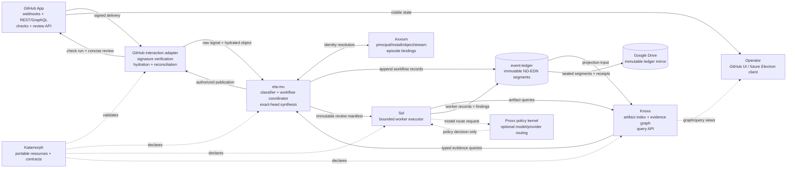
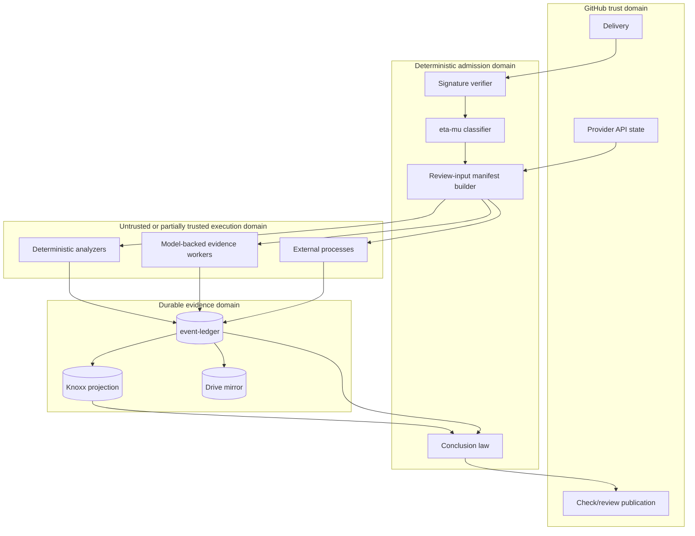
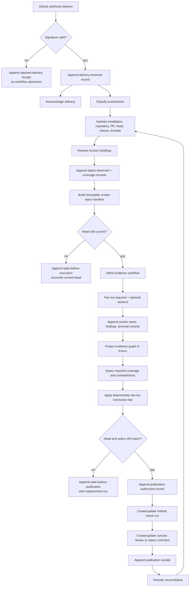
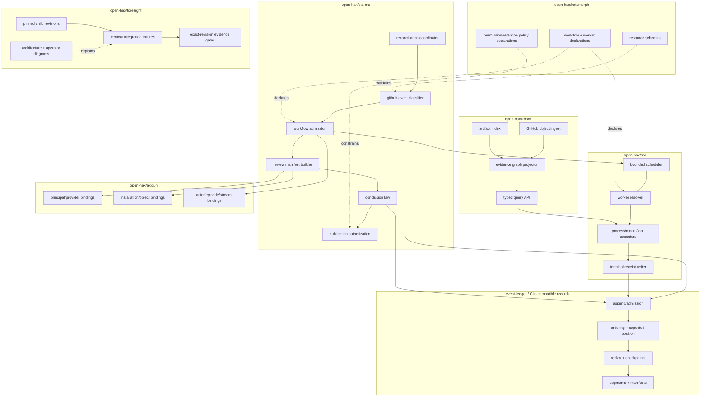
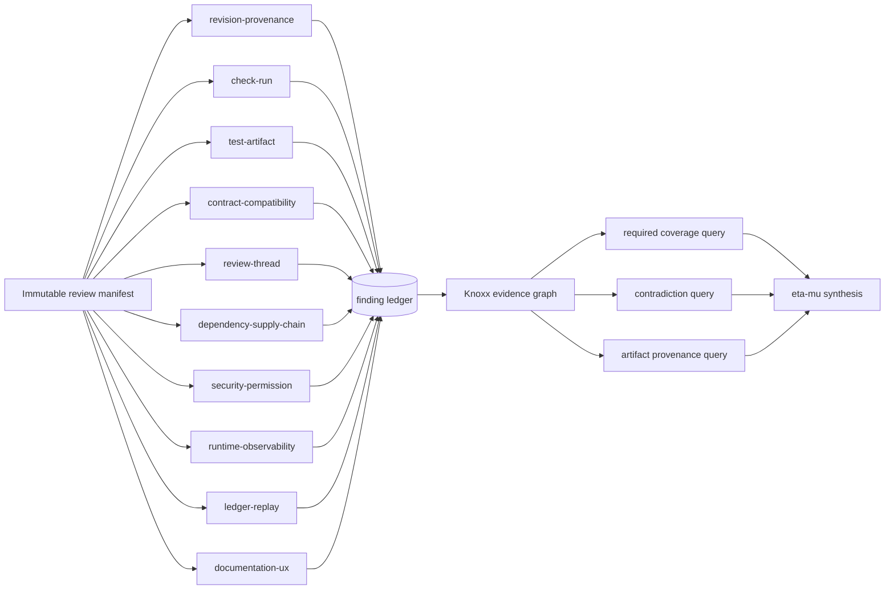
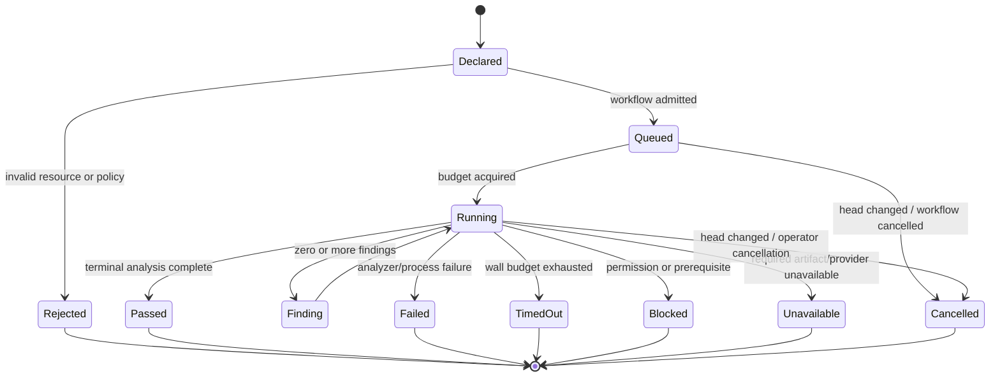
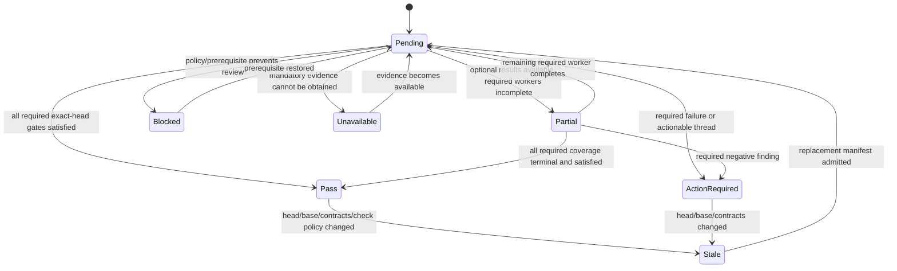

# Eta-mu GitHub Evidence Workflow

**Status:** proposed executable architecture  
**Parent:** `open-hax/foresight#69`  
**Related contract slices:** `open-hax/katamorph#27`, `open-hax/knoxx#294`  
**Primary outcome:** eta-mu responds to GitHub App events through bounded Sol evidence workers and Knoxx evidence queries, then publishes an exact-head check and review whose claims can be traced to append-only records.

## Decision

Eta-mu is the workflow and conclusion authority. It does not become a GitHub
object database, a general graph store, an all-purpose agent runtime, or a
provider-secret vault.

- A GitHub App adapter verifies, acknowledges, hydrates, reconciles, and publishes.
- Eta-mu classifies deliveries, admits workflows, pins exact review inputs,
  selects required evidence roles, synthesizes conclusions, and authorizes
  publication.
- Axxium binds principals, installations, repositories, provider objects,
  actors, execution episodes, and streams.
- Sol executes bounded evidence workers against immutable manifests.
- Knoxx indexes GitHub objects, code/documents, checks, test artifacts, review
  threads, findings, and their evidence graph.
- Clio-compatible records plus event-ledger preserve append, ordering,
  idempotency, replay, checkpoints, and terminal evidence.
- Katamorph declares portable actors, sources, actions, stores, workflows,
  policies, worker profiles, and capabilities.

No model-backed worker may directly turn its prose into a green GitHub check.
Workers attest; eta-mu applies deterministic conclusion law.

## System topology



### Trust boundaries



The publication adapter receives a decision record, not free-form worker output.
Provider tokens are available only to the interaction/publication adapter.

## Data lifecycle



A webhook delivery starts observation. It is not proof that provider history is
complete. Reconciliation reads current provider state and repairs missed,
failed, duplicated, or reordered delivery effects.

## Event and evidence families

```mermaid
classDiagram
  class DeliverySignal {
    record/id
    source/delivery-id
    github/event
    github/action
    observed-at
    payload/hash
  }
  class ObjectObservation {
    record/id
    axxium/object-binding
    source/object-id
    source/revision
    coverage/status
  }
  class ReviewManifest {
    manifest/digest
    repository/id
    base/sha
    head/sha
    changed-paths
    contract-revisions
    artifact-catalog/digest
  }
  class WorkerAttempt {
    execution/id
    worker/id
    worker/version
    budget
    attempt/id
    outcome
  }
  class EvidenceFinding {
    finding/id
    rule/id
    rule/revision
    subject
    outcome
    severity
    confidence
    reason-codes
    artifact-refs
    coverage
  }
  class SynthesisDecision {
    decision/id
    head/sha
    outcome
    reason-codes
    required-worker-state
    supporting-records
    digest
  }
  class PublicationReceipt {
    publication/id
    github/check-run-id
    github/review-id
    head/sha
    decision/id
    observed-result
  }

  DeliverySignal --> ObjectObservation : causes hydration
  ObjectObservation --> ReviewManifest : pins
  ReviewManifest --> WorkerAttempt : admitted input
  WorkerAttempt --> EvidenceFinding : emits
  EvidenceFinding --> SynthesisDecision : evaluated by
  SynthesisDecision --> PublicationReceipt : authorizes
```



### Identity separation

The following values are never interchangeable:

- GitHub delivery ID;
- provider event/action;
- GitHub node/database ID;
- Axxium object binding;
- event-ledger physical record ID;
- logical event/deduplication ID;
- stream ID and stream position;
- review-manifest digest;
- worker logical execution and attempt IDs;
- evidence finding ID;
- synthesis decision ID;
- GitHub check-run/review/comment ID;
- commit SHA, tree SHA, artifact hash, and contract revision.

## Code and repository ownership



### Dependency direction

Portable data and pure laws point inward. Provider SDKs, GitHub tokens, process
spawning, model clients, databases, and file/network effects remain host
adapters. A child repository can be tested independently; Foresight proves the
pinned composition without duplicating child implementation.

## Evidence worker graph



### Role contracts

| Worker | Primary evidence | Deterministic first | Must report |
| --- | --- | --- | --- |
| revision-provenance | commits, trees, submodules, manifests, artifact hashes | yes | stale or mismatched revision, missing pin, dirty inputs |
| check-run | check suites/runs, jobs, steps, annotations | yes | required state, attempt, conclusion, head binding |
| test-artifact | JUnit/TAP/coverage/build outputs and logs | yes | command relation, counts, digest, absent/inaccessible evidence |
| contract-compatibility | EDN resources, schemas, API shapes, dependency revisions | mostly | broken law, compatibility risk, exact rule revision |
| review-thread | review comments and changed code | mixed | actionable/resolved/superseded with exact-head proof |
| dependency-supply-chain | lockfiles, toolchain pins, generated files, provenance | yes | drift, incompatible pin, untrusted/generated mismatch |
| security-permission | signatures, token scopes, secrets, trust boundaries | mixed | exploit/risk path, permission excess, missing verification |
| runtime-observability | exits, timeouts, retries, health, traces | yes | missing terminal state, false pass, retry/queue anomaly |
| ledger-replay | record IDs, causal links, stream positions, hashes | yes | collision, duplicate effect, missing parent, replay variance |
| documentation-ux | operator flow, errors, docs, diagrams | mixed | undocumented state, misleading UI, unactionable output |

Deterministic analyzers should answer a role before a model is invoked. A model
may interpret ambiguous evidence, but must cite the inspected artifacts and
cannot manufacture missing evidence.

## Worker execution state machine



Every path emits exactly one terminal worker record. `Passed` means the worker
completed its analysis; it does not mean the pull request passed review.

## Review conclusion state machine



A skipped or cancelled required GitHub check, an unresolved actionable thread,
an inaccessible mandatory artifact, or a finding bound to another head cannot be
coerced into `Pass`.

## GitHub check contract

One stable required check should represent eta-mu synthesis. Individual worker
checks may be emitted for observability, but branch protection should not require
an unbounded dynamic list.

Suggested names:

```text
eta-mu / evidence-review        required synthesized conclusion
eta-mu / intake                 webhook/hydration/input-manifest health
eta-mu / evidence/<role>        optional role visibility
foresight / exact-revision      cross-repository pinned integration gate
```

The synthesized check output includes:

- exact base/head SHA and manifest digest;
- decision and stable reason codes;
- required worker terminal states;
- required GitHub check states;
- unresolved actionable thread count;
- missing/inaccessible/partial evidence;
- top actionable findings with artifact references;
- decision-record ID, evidence stream/position range, and Knoxx query locator;
- replacement-run identity when stale.

The check is updated idempotently for one repository, pull request, head SHA,
review run, and output kind. A new head gets a new review run; old check records
remain historical.

## Operator experience

```mermaid
sequenceDiagram
  actor Dev as Developer
  participant GH as GitHub
  participant EM as eta-mu
  participant SO as Sol workers
  participant KX as Knoxx

  Dev->>GH: Open or update pull request
  GH->>EM: Signed pull_request/check/review webhook
  EM->>GH: Acknowledge quickly
  EM->>GH: Publish intake check: queued
  EM->>KX: Hydrate/index exact PR head and artifacts
  EM->>SO: Admit immutable review manifest + worker graph
  par Fast deterministic evidence
    SO->>KX: Query checks, commits, lockfiles, test artifacts
    SO-->>EM: Append typed findings and terminal receipts
  and Focused interpretive evidence
    SO->>KX: Query changed contracts, threads, docs, runtime traces
    SO-->>EM: Append cited findings and terminal receipts
  end
  EM->>KX: Query required coverage + contradictions
  EM->>GH: Update evidence-review check
  alt clean exact head
    EM->>GH: Concise approval/evidence summary
    GH-->>Dev: Green required check with traceable evidence
  else actionable evidence
    EM->>GH: Request changes with exact files/rules/artifacts
    GH-->>Dev: Focused repair list; no generic review prose
  else incomplete/stale
    EM->>GH: Pending/blocked/stale with reason and replacement run
    GH-->>Dev: Truthful non-green state
  end
  Dev->>GH: Push repair
  GH->>EM: New-head webhook
  EM->>EM: Cancel stale workers; preserve their records
  EM->>SO: Start replacement exact-head review
```

### UX principles

- Show what is known, what is missing, and what exact revision was reviewed.
- Lead with actionable failures; keep full provenance one query away.
- Do not repeat unchanged findings on every run unless they remain actionable.
- Separate “worker completed” from “gate passed.”
- Distinguish stale, partial, unavailable, blocked, and failed.
- Allow the operator to inspect the graph from a check, finding, artifact, commit,
  review thread, test run, or ledger record.
- Future Electron UI reuses the same query and command contracts; it does not
  introduce a second workflow or evidence database.

## Workflow resource sketch

```clojure
{:workflow/id :eta-mu/github-evidence-review
 :workflow/version 1
 :workflow/triggers
 [{:on/event :github/pull-request-observed}
  {:on/event :github/check-suite-observed}
  {:on/event :github/review-thread-observed}
  {:on/cron "17 */3 * * *" :mode :reconcile}]
 :workflow/input
 {:manifest/profile :eta-mu/review-input-v1
  :identity/supplier :axxium
  :revision-binding :exact-head}
 :workflow/jobs
 [{:job/id :hydrate-and-pin
   :job/action :github/build-review-manifest}
  {:job/id :evidence-fanout
   :job/needs [:hydrate-and-pin]
   :job/strategy :parallel
   :job/workers [:evidence/revision-provenance
                 :evidence/check-run
                 :evidence/test-artifact
                 :evidence/contract-compatibility
                 :evidence/review-thread
                 :evidence/dependency-supply-chain
                 :evidence/security-permission
                 :evidence/runtime-observability
                 :evidence/ledger-replay
                 :evidence/documentation-ux]}
  {:job/id :synthesize
   :job/needs [:evidence-fanout]
   :job/action :eta-mu/synthesize-exact-head-review}
  {:job/id :publish
   :job/needs [:synthesize]
   :job/action :github/publish-review-decision}
  {:job/id :project
   :job/needs [:evidence-fanout :synthesize :publish]
   :job/action :knoxx/project-evidence-graph}]}
```

This is a shape target, not a claim that the current Katamorph workflow schema
already accepts every key. The implementation must use or add the smallest
portable contracts proven by at least two hosts.

## First executable slice

Use one signed `pull_request.synchronize` fixture and one exact repository head.
The fixture should produce:

1. a verified raw delivery record;
2. hydrated repository, pull request, base/head, changed-path, check, and review
   thread observations with explicit coverage;
3. Axxium bindings for installation, repository, pull request, actors, execution
   episode, and streams;
4. an immutable review-input manifest;
5. concurrent `revision-provenance`, `check-run`, `review-thread`, and
   `ledger-replay` worker attempts in Sol;
6. typed findings and terminal records;
7. a rebuildable Knoxx evidence graph;
8. a deterministic eta-mu decision record;
9. an idempotent GitHub check-run publication fixture;
10. a revision-bound test record whose evidence survives ledger replay.

### Completion proof

- Delivering the same webhook twice produces no duplicate semantic workflow or
  publication effect while retaining truthful physical receipts.
- Changing the head during worker execution cancels or stales the old run and
  prevents publication against the new head.
- Removing a required artifact produces `partial`, `blocked`, or `unavailable`,
  never pass.
- Injecting one actionable review thread produces `action-required` until a
  later exact-head observation proves it resolved or superseded.
- Deleting Knoxx projections and replaying admitted records produces the same
  logical nodes, edges, current gate state, and evidence references.
- Every test invocation appends started and terminal records bound to exact
  repository and contract revisions.

## Board decomposition

The work is tracked as bounded repository lanes:

- eta-mu parent: **GitHub webhook to evidence-agent workflow**;
- eta-mu law: **exact-head GitHub check and review synthesis**;
- eta-mu orchestration: **typed evidence micro-agent fan-out**;
- Sol: **evidence worker execution from immutable review manifests**;
- Knoxx: **GitHub evidence graph and query contract**;
- Foresight: pinned vertical integration, diagrams, and completion evidence;
- existing Axxium identity and eta-mu event-ledger/GitHub-classifier cards remain
  dependencies rather than being duplicated.

## Non-goals

- Letting every micro-agent create its own required GitHub check.
- Depending on mutable model conversation state for replay or reconciliation.
- Treating a successful worker process as a clean code review.
- Publishing free-form model output without deterministic decision and evidence
  records.
- Giving Knoxx, Sol, Katamorph resources, Drive mirrors, or worker logs provider
  refresh tokens or installation secrets.
- Claiming complete GitHub history from webhook delivery alone.
- Building the Electron client before the same workflow is proven through the
  GitHub operator surface.
